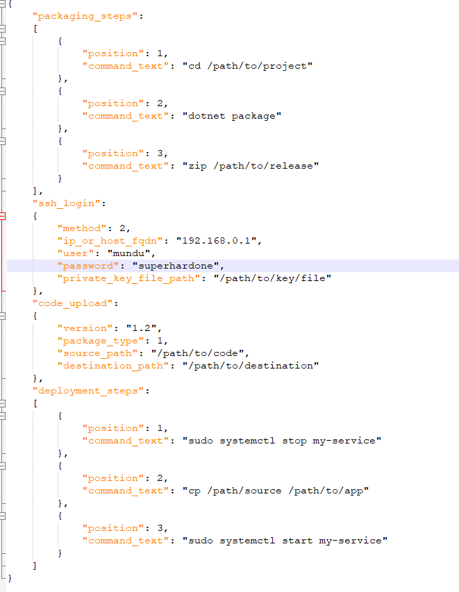

# SCIFINITY

This is an attempt to deploy source code to an ssh supporting server and run any number of commands on that server.

The inspiration has come from the many projects that I manage that don't really need a fully fledged CI/CD platform but still don't want upload files and edit configuration. Can this be made simpler? 

The assumption here is that the code is available on the disk and the correct branch is checked out. 

The philosophy here is simple, we have our code and run it from a bunch of machines and all we want to do is get it there without complicating the whole pipeline. This is for you if you are the developer starting out the CI/CD journey but does not have the skills and budget of a fully fledged tool like Jenkins, Octopus deploy, Chef, Puppet, Azure Devops etc and is deploying code by hand. 

## Deployment configuration

The deployment configuration file is a json file that has the following sections:-
 - Packaging steps
 - SSH login
 - Package upload
 - Deployment commands

We would potentially deploy the source code as follows:-

``scifinity /path/to/config``

